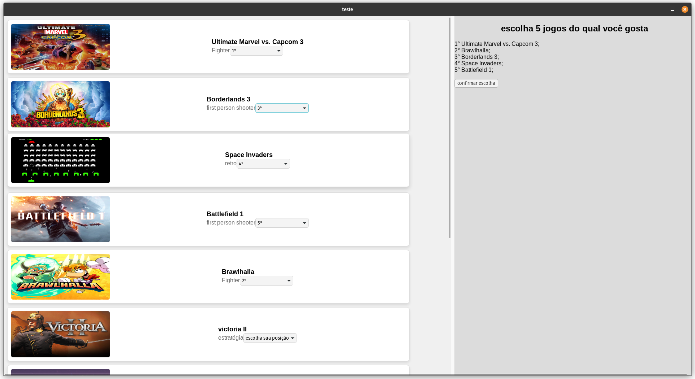
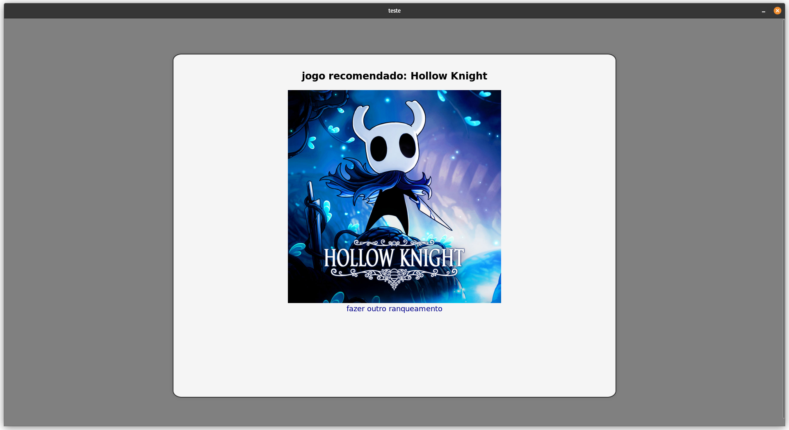
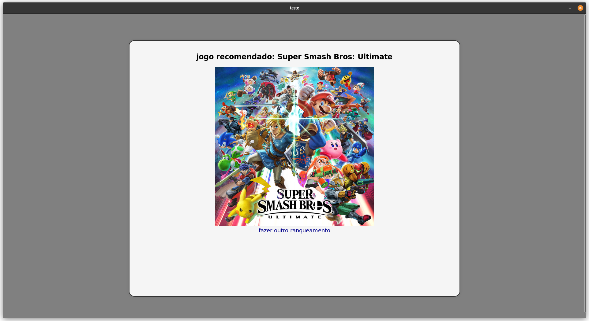

# Dividir e Conquistar

**Número da Lista**: 27<br>
**Conteúdo da Disciplina**: dividir e conquistar, counting inversion<br>

## Alunos
|Matrícula | Aluno |
| -- | -- |
| 21/2005444  |  Pedro Fonseca Cruz |

## Sobre
O recomendador de jogos é um algorítimo que recomenda jogos baseado nas escolhas que vocês apresenta à ele, então entrega uma recomendação de um jogo novo baseado nas suas preferencias. Ele utiliza o algorítimo de counting inversion.


## Screenshots




## Instalação
**Linguagem**: Rust<br>
Utilizo a biblioteca tauri para o front end. a biblioteca é como se fosse um browser, então a gui funciona como se fosse um site com html css e js. Mas o algorítimo roda em rust como se fosse o backend.

instalação rust: https://doc.rust-lang.org/book/ch01-01-installation.html
pre-requisitos tauri: https://tauri.app/v1/guides/getting-started/prerequisites

link do passo a passo de instalação: https://www.howtogeek.com/790062/how-to-install-bash-on-windows-11/.

## Uso
para utilizar o programa você deve rodar o código rust dentro da pasta "/scr-tauri". tenha certeza que os pre-requisitos tanto do rust quanto do tauri foram instalados corretamente
comandos para compilação pelo terminal:<br>

dentro de /src-tauri:
```console
cargo run
```

## Video

O video esta neste [link do google](https://drive.google.com/drive/folders/1xIbdensyIBQKSg6PQeVZTy7ghQJnvmRk?usp=sharing) drive.
